# IBM i Company System - Technical Documentation

## Table of Contents
1. [System Overview](#system-overview)
2. [Architecture](#architecture)
3. [Module Descriptions](#module-descriptions)
4. [Data Flow Diagrams](#data-flow-diagrams)
5. [Program Call Sequences](#program-call-sequences)
6. [Database Schema](#database-schema)
7. [Build Configuration](#build-configuration)
8. [Include Files](#include-files)

---

## System Overview

The IBM i Company System is a multi-tier application for managing departments and employees. It provides interactive screens for viewing departments, browsing employees by department, and adding new employees.

### Key Features
- Department listing with subfile display
- Employee browsing by department
- New employee creation with validation
- Service program for data retrieval
- SQL-based data access layer

### Technology Stack
- **Language**: RPG IV (ILE RPG) - Free-form
- **Database**: Db2 for IBM i
- **UI**: Display Files (DSPF) with Subfiles
- **Architecture**: Modular with service programs

---

## Architecture

### System Architecture Diagram

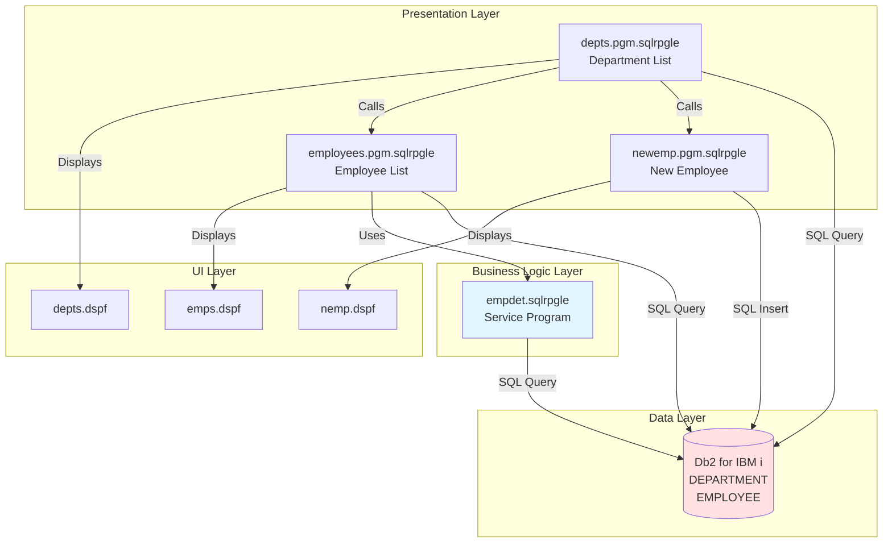

### Component Relationships

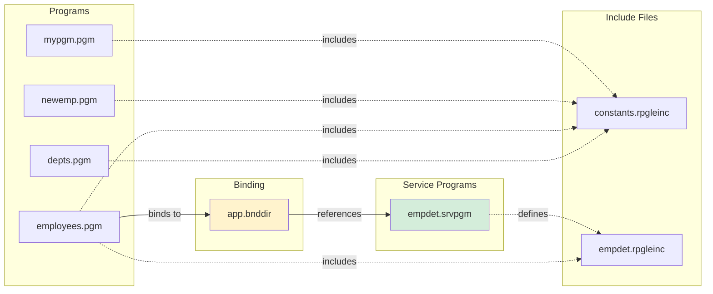

---

## Module Descriptions

### 1. depts.pgm.sqlrpgle - Department List Program

**Purpose**: Main entry point displaying all departments in a subfile with options to view employees or add new employees.

**Control Specifications**:
- `DFTACTGRP(*NO)`: Program runs in a named activation group (not default)

**Key Components**:

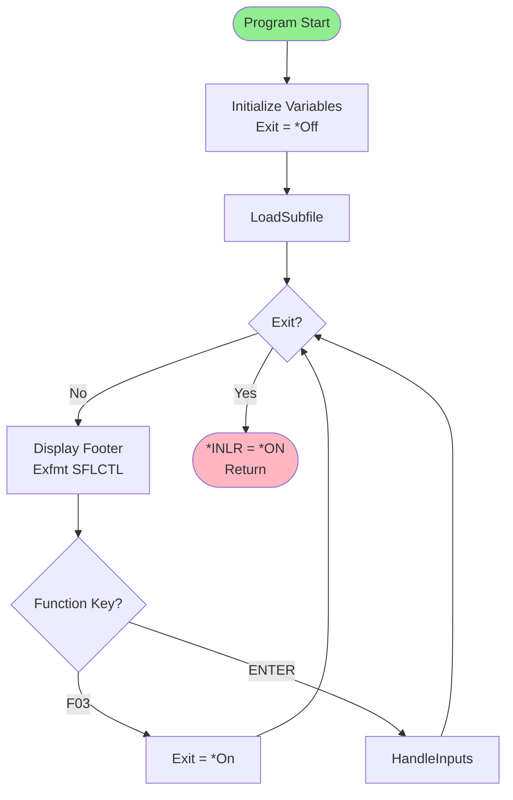

**File Specifications**:
- Display file: `depts` (WORKSTN)
- Subfile: `SFLDta` with RRN control
- Indicator DS: `WkStnInd` for screen control
- File Info DS: `fileinfo` for function key detection

**Data Structures**:
- `Department`: Externally described from DEPARTMENT table with alias names
- `WkStnInd`: Maps indicators to positions for subfile control

**Procedures**:

1. **ClearSubfile()**
   - Turns off subfile display and control indicators
   - Writes SFLCTL record to clear buffer
   - Resets RRN (Relative Record Number) to 0

2. **LoadSubfile()**
   ```mermaid
   flowchart LR
       A[Clear Subfile] --> B[Declare Cursor<br/>deptCur]
       B --> C[Open Cursor]
       C --> D{SQL OK?}
       D -->|Yes| E[Fetch Loop]
       E --> F{More Records?}
       F -->|Yes| G[Fetch Department]
       G --> H[Populate Subfile<br/>XID, XNAME]
       H --> I[Write SFLDTA<br/>rrn += 1]
       I --> F
       F -->|No| J[Close Cursor]
       D -->|No| J
       J --> K{rrn > 0?}
       K -->|Yes| L[SflDsp = *On<br/>SFLRRN = 1]
       K -->|No| M[End]
       L --> M
   ```

3. **HandleInputs()**
   - Reads changed subfile records (ReadC)
   - Processes user selections:
     - Option '5': Call `Employees()` program
     - Option '8': Call `NewEmp()` program
   - Clears selection field after processing

**SQL Operations**:
```sql
DECLARE deptCur CURSOR FOR
  SELECT DEPTNO, DEPTNAME
  FROM DEPARTMENT
```

---

### 2. employees.pgm.sqlrpgle - Employee List Program

**Purpose**: Displays employees for a specific department with total salaries.

**Control Specifications**:
- `DFTACTGRP(*NO)`: Named activation group
- `BNDDIR('APP')`: Uses APP binding directory for service program access

**Parameters**:
- `DEPTNO` (Char(3)): Department number passed from calling program

**Key Components**:

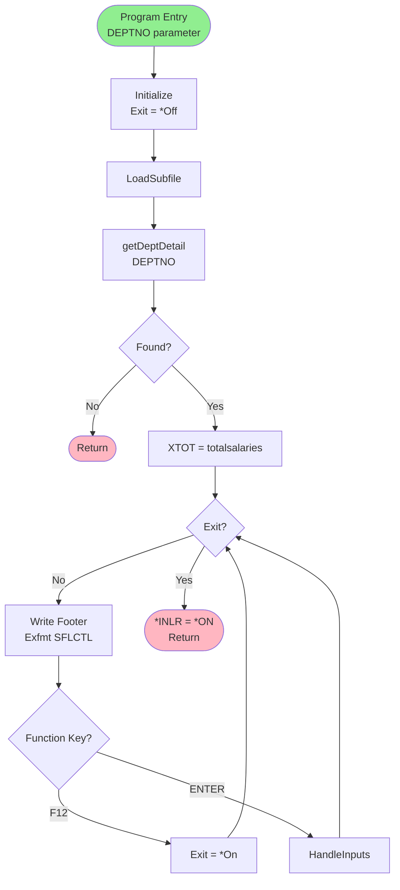

**File Specifications**:
- Display file: `emps` (WORKSTN)
- Subfile: `SFLDta` with RRN control

**Procedures**:

1. **LoadSubfile()**
   ```sql
   DECLARE empCur CURSOR FOR
     SELECT EMPNO, FIRSTNME, LASTNAME, JOB
     FROM EMPLOYEE
     WHERE WORKDEPT = :DEPTNO
   ```
   - Fetches all employees for the specified department
   - Formats name as "LASTNAME, FIRSTNAME"
   - Populates subfile with employee data

2. **HandleInputs()**
   - Processes option '5': Display employee ID (DSPLY XID)
   - Clears selection after processing

**External Dependencies**:
- Service Program: `EMPDET` (via APP binding directory)
- Procedure: `getDeptDetail()`

---

### 3. newemp.pgm.sqlrpgle - New Employee Program

**Purpose**: Interactive screen for adding new employees with validation.

**Control Specifications**:
- `DFTACTGRP(*NO)`: Named activation group

**Parameters**:
- `currentDepartment` (Char(3)): Department for new employee

**Program Flow**:

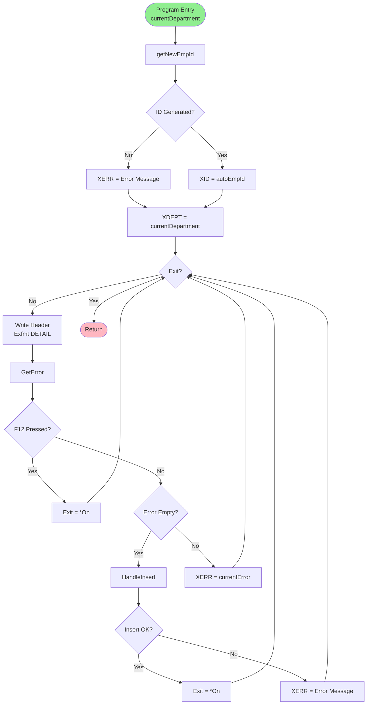

**Procedures**:

1. **HandleInsert()**
   - Creates new employee data structure
   - Populates fields from screen input
   - Sets default values for unused fields
   - Executes SQL INSERT with NC (no commit)
   ```sql
   INSERT INTO EMPLOYEE
   VALUES (:newEmp)
   WITH NC
   ```

2. **GetError()**
   - Validates all required fields:
     - First name, middle initial, last name
     - Department, job title
     - Salary (must be numeric)
     - Phone number (must be numeric)
   - Returns error message or empty string

3. **getNewEmpId()**
   ```mermaid
   flowchart LR
       A[Initialize<br/>result = '000000'] --> B[SQL: SELECT MAX<br/>INT EMPNO]
       B --> C{SQL OK?}
       C -->|Yes| D[highestEmpId + 100]
       D --> E[Convert to Char]
       E --> F[Right-align in result]
       F --> G[Return result]
       C -->|No| H[Return empty string]
       
       style G fill:#90EE90
       style H fill:#FFB6C1
   ```
   - Generates next employee ID by finding max and adding 100
   - Returns 6-character zero-padded ID

---

### 4. empdet.sqlrpgle - Employee Detail Service Program

**Purpose**: Reusable service program providing data retrieval procedures.

**Control Options**:
- `NOMAIN`: No main procedure (service program only)

**Exported Procedures**:

#### getEmployeeDetail()

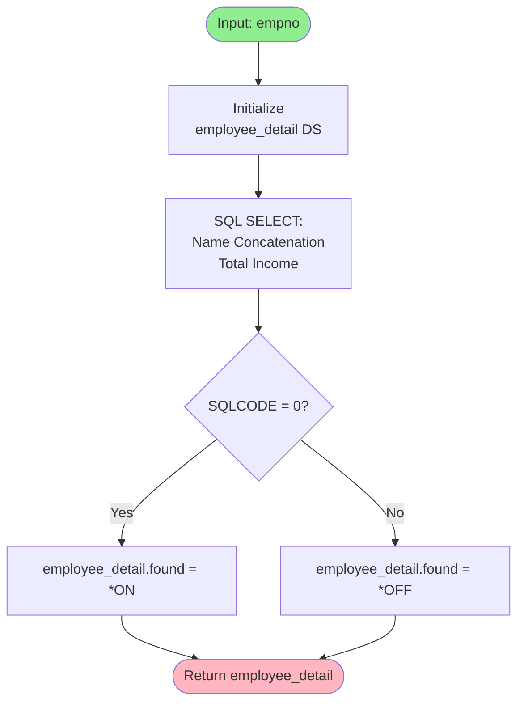

**SQL Query**:
```sql
SELECT
  RTRIM(FIRSTNME) || ' ' || RTRIM(MIDINIT) || ' ' || RTRIM(LASTNAME),
  SALARY + BONUS + COMM
INTO
  :employee_detail.name,
  :employee_detail.netincome
FROM
  EMPLOYEE
WHERE
  EMPNO = :empno
```

**Returns**: `employee_detail_t` structure with:
- `found`: Indicator if employee exists
- `name`: Full formatted name
- `netincome`: Total compensation

#### getDeptDetail()

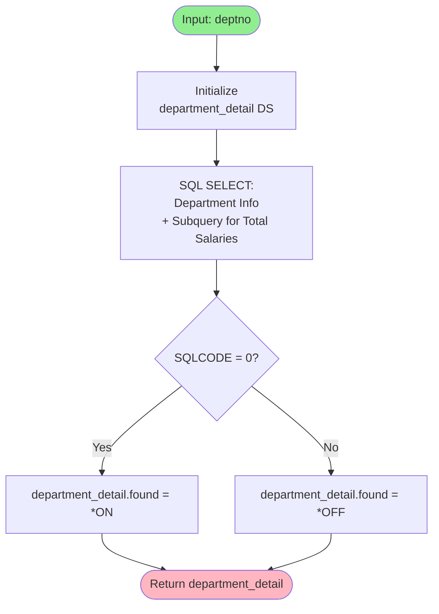

**SQL Query**:
```sql
SELECT
  RTRIM(DEPTNAME),
  COALESCE(LOCATION, 'N/A'),
  (SELECT SUM(SALARY + BONUS + COMM)
   FROM EMPLOYEE
   WHERE WORKDEPT = :deptno)
INTO
  :department_detail.deptname,
  :department_detail.location,
  :department_detail.totalsalaries
FROM
  DEPARTMENT
WHERE
  DEPTNO = :deptno
```

**Returns**: `department_detail_t` structure with:
- `found`: Indicator if department exists
- `deptname`: Department name
- `location`: Department location (or 'N/A')
- `totalsalaries`: Sum of all employee compensation

---

### 5. mypgm.pgm.rpgle - Simple Test Program

**Purpose**: Demonstration program showing external C function call.

**Control Specifications**:
- `DFTACTGRP(*NO)`: Named activation group

**Key Features**:
- Calls C `printf()` function via external procedure
- Uses `DSPLY` operation for display
- Simple "Hello World" style program

**Code Flow**:
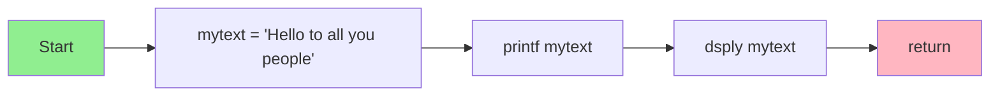

---

## Data Flow Diagrams

### Department to Employee Navigation Flow

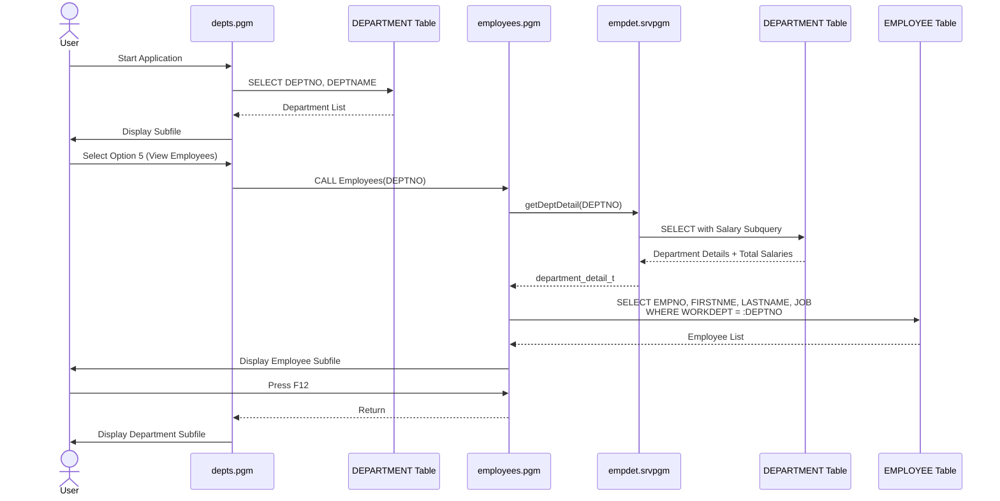

### New Employee Creation Flow

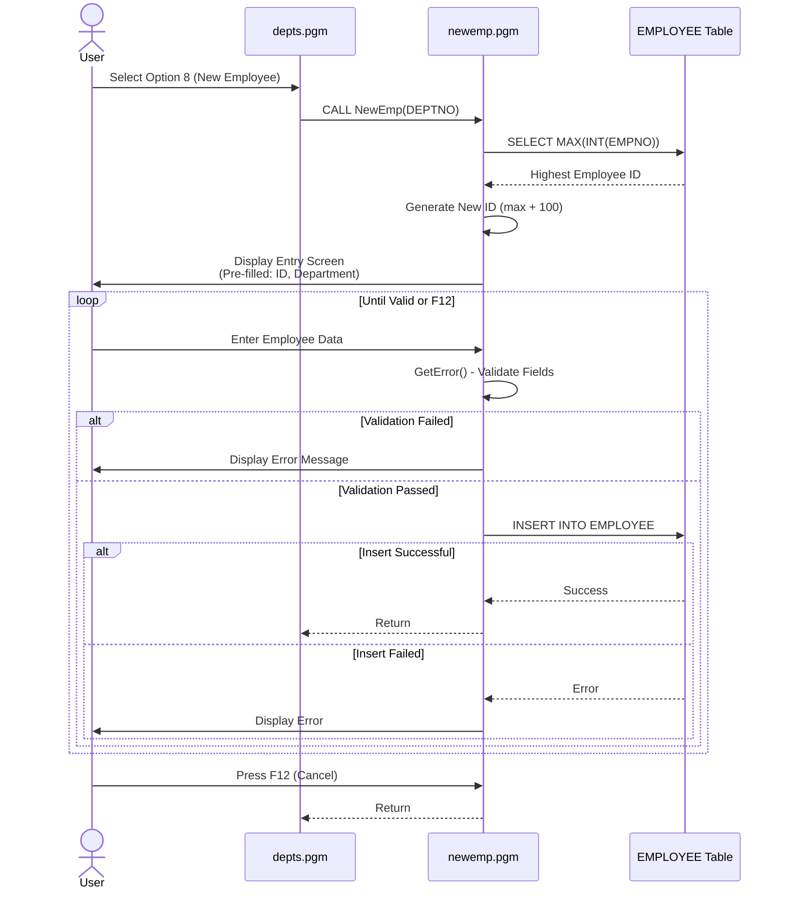

### Service Program Data Retrieval

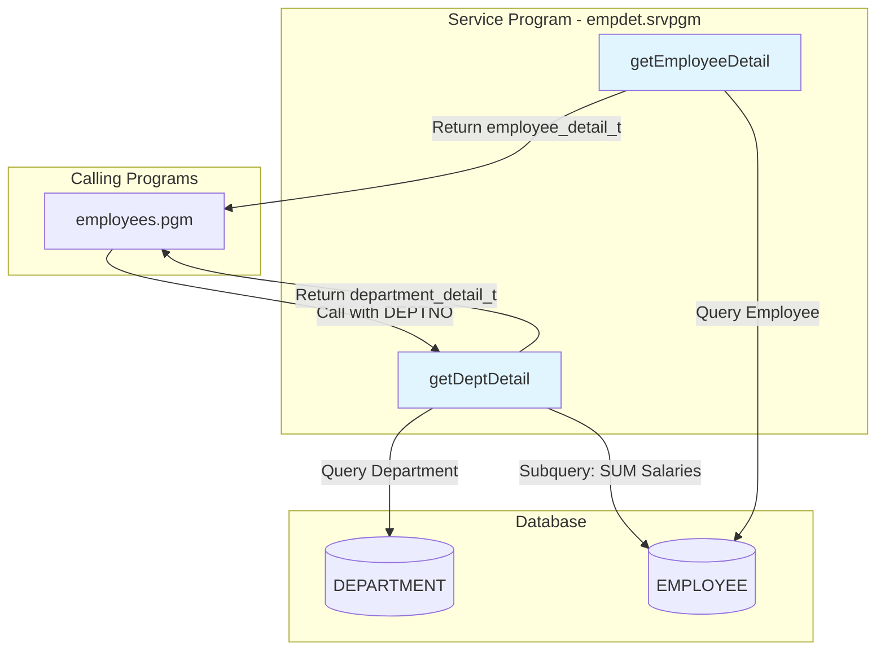

---

## Program Call Sequences

### Complete Application Flow

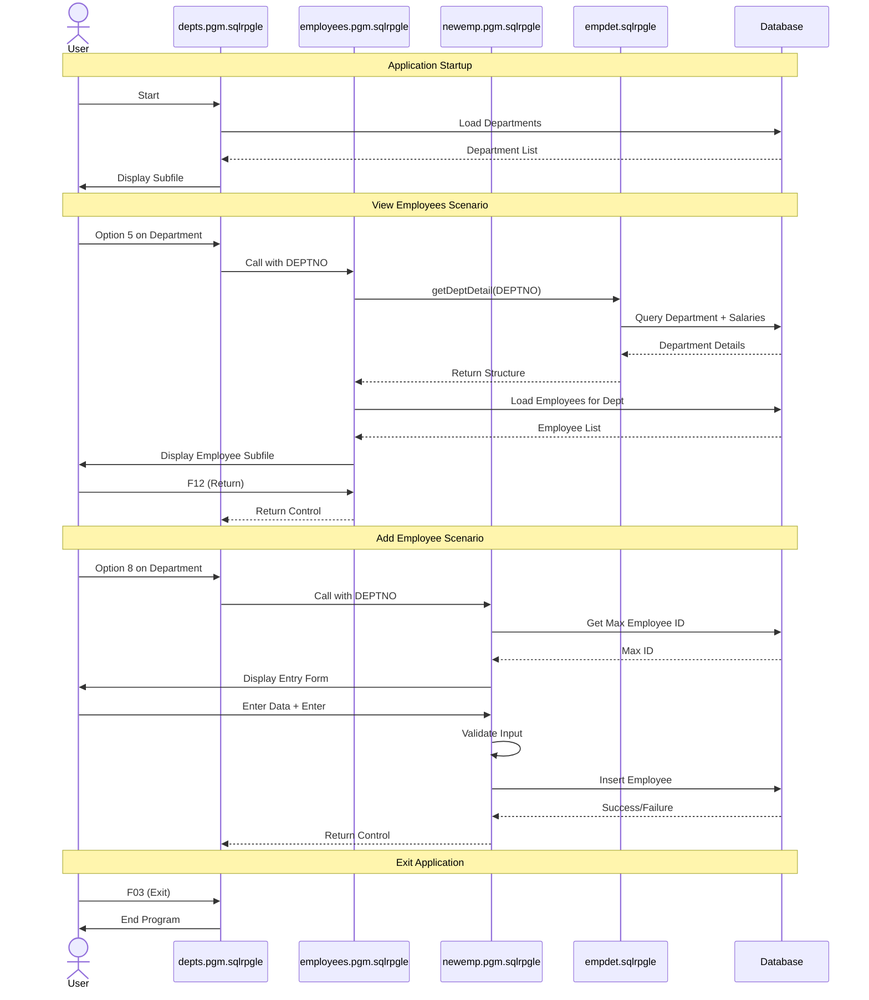

---

## Database Schema

### Entity Relationship Diagram

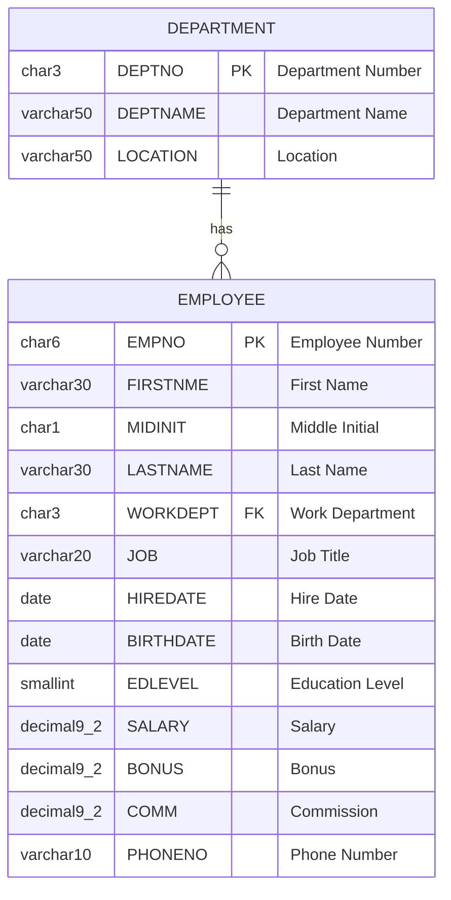

### Table Descriptions

#### DEPARTMENT Table
- **Primary Key**: DEPTNO
- **Purpose**: Stores department information
- **Used By**: 
  - `depts.pgm.sqlrpgle` - List all departments
  - `empdet.sqlrpgle` - Get department details

#### EMPLOYEE Table
- **Primary Key**: EMPNO
- **Foreign Key**: WORKDEPT → DEPARTMENT.DEPTNO
- **Purpose**: Stores employee information
- **Used By**:
  - `employees.pgm.sqlrpgle` - List employees by department
  - `newemp.pgm.sqlrpgle` - Insert new employees
  - `empdet.sqlrpgle` - Get employee details

---

## Build Configuration

### Binding Directory Structure

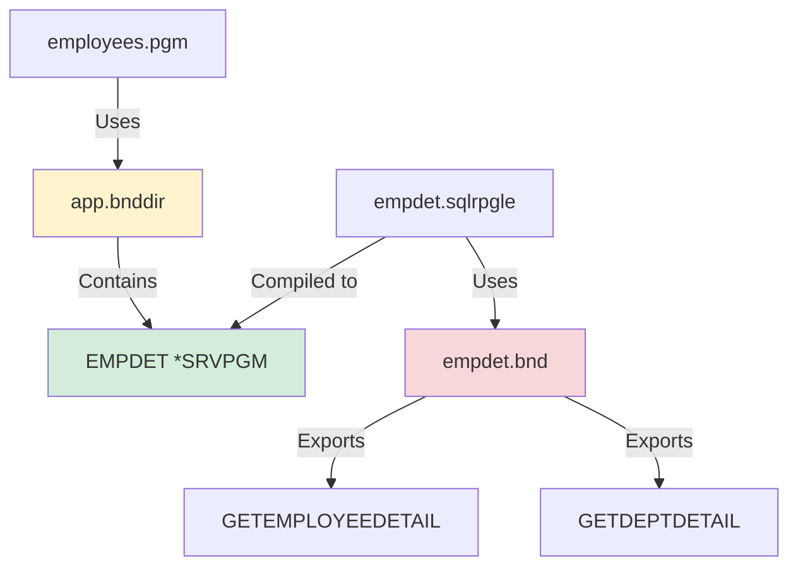

### Build Process

**app.bnddir** - Binding Directory Creation:
```cl
/* Delete existing binding directory */
DLTOBJ OBJ(&O/&N) OBJTYPE(*BNDDIR)

/* Create new binding directory */
CRTBNDDIR BNDDIR(&O/&N)

/* Add service program entry */
ADDBNDDIRE BNDDIR(&O/&N) OBJ((*LIBL/EMPDET *SRVPGM))
```

**empdet.bnd** - Service Program Exports:
```
STRPGMEXP  PGMLVL(*CURRENT) SIGNATURE('V1')
  EXPORT SYMBOL('GETEMPLOYEEDETAIL')
  EXPORT SYMBOL('GETDEPTDETAIL')
ENDPGMEXP
```

---

## Include Files

### constants.rpgleinc - Function Key Constants

**Purpose**: Defines hexadecimal constants for function keys and special keys.

**Constants Defined**:
- F01 through F24: Function keys
- ENTER: Enter key
- HELP: Help key
- PRINT: Print key

**Usage**: Included in all interactive programs for function key detection.

**Example**:
```rpgle
Dcl-C F03 X'33';  // Function key 3
Dcl-C F12 X'3C';  // Function key 12
Dcl-C ENTER X'F1'; // Enter key
```

### empdet.rpgleinc - Service Program Interface

**Purpose**: Defines data structures and prototypes for the empdet service program.

**Data Structures**:

1. **employee_detail_t** (Template)
   - `found` (Ind): Indicator if employee was found
   - `name` (Varchar(50)): Full formatted employee name
   - `netincome` (Packed(9:2)): Total compensation

2. **department_detail_t** (Template)
   - `found` (Ind): Indicator if department was found
   - `deptname` (Varchar(50)): Department name
   - `location` (Varchar(50)): Department location
   - `totalsalaries` (Packed(9:2)): Sum of all employee salaries

**Prototypes**:

1. **getDeptDetail()**
   - Parameter: `deptno` (Char(3) const)
   - Returns: `department_detail_t` structure
   - External Procedure: 'GETDEPTDETAIL'

2. **getEmployeeDetail()**
   - Parameter: `empno` (Char(6) const)
   - Returns: `employee_detail_t` structure
   - External Procedure: 'GETEMPLOYEEDETAIL'

---

## Summary

This IBM i Company System demonstrates modern RPG development practices:

1. **Modular Design**: Separation of concerns with service programs
2. **SQL Integration**: Embedded SQL for database operations
3. **Reusable Components**: Include files for constants and interfaces
4. **Interactive UI**: Subfile-based screens for data display
5. **Data Validation**: Input validation before database operations
6. **Error Handling**: SQL state checking and user feedback

The application follows a three-tier architecture with clear separation between presentation (display files), business logic (service programs), and data access (SQL queries).